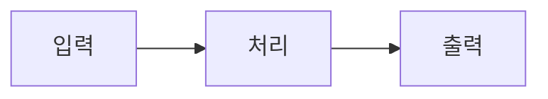

---
과목:
단원:
tags: []
작성일:
복습일:
---

# 

> [!summary] 핵심 요약
> 

> [!warning] 자주 틀리는 포인트
> 

## 개념 정리

## 그림

```mermaid
flowchart LR
    A[입력] --> B[처리] --> C[출력]
```

## 관련 단원

- 

## 체크리스트

- [ ] 
